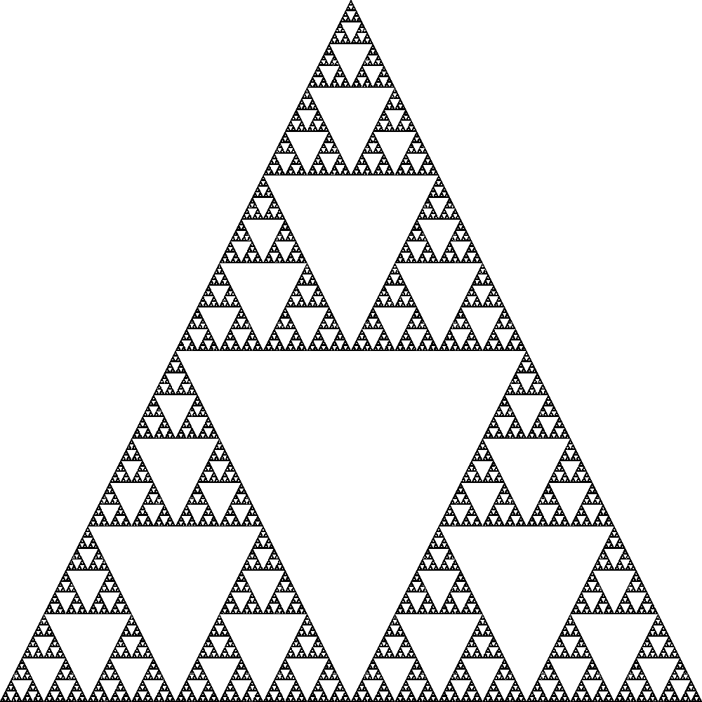
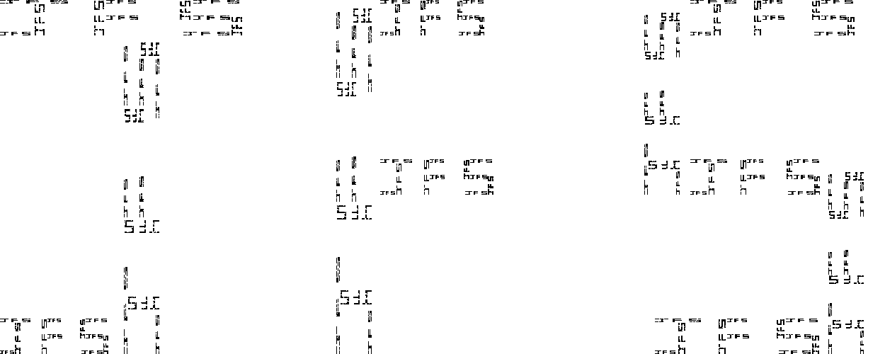

# Q-Fractals
Making fractal images in q

### The Mandelbrot set:

    

### A Julia set with c = -0.7269 + 0.1889i

    

### Iterated Funciton System giving the sierpenski triangle

    

### Iterated Function System drawing initials

    
